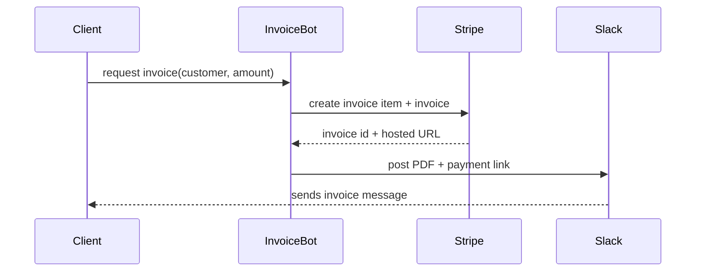

# Finance Ops Pack Playbook

The Finance Ops Pack adds budgeting, invoicing, and cost-alerting capabilities to any BlackRoad deployment. It is designed to be self-contained so you can drop it into a new environment and immediately gain FinOps visibility.

## Getting started
1. Install the pack
   ```bash
   brctl pack install finance --target=/srv/blackroad
   ```
2. Configure role bindings for the **Growth Catalyst** and **Policy Steward** roles.
3. Deploy the provided agents via your orchestrator of choice and point them at your Slack workspace and billing providers.

## Service level expectations
| Capability | SLO | Notes |
| --- | --- | --- |
| Burn rate forecasting | 95% weekly cadence | Budgeteer posts a weekly summary to the configured channel. |
| Invoice delivery | 99% of invoices delivered within 5 minutes | Invoice bot relies on Stripe webhooks for delivery confirmation. |
| Cost anomaly alerts | <5 minutes from stream ingestion | Cost watcher streams CloudWatch spend anomalies directly to Slack. |

## KPI glossary
- **MTD Spend**: Month-to-date cost pulled from AWS Cost Explorer or your billing graph.
- **Daily Burn**: Average spend per calendar day since the month started.
- **Forecasted Month-End**: Projected total spend using the current burn rate.
- **Budget Consumption**: Percentage of forecasted spend versus allocated budget.
- **Invoice Latency**: Time from invoice creation to customer delivery.

## Invoice flow


## Troubleshooting
- Validate that `pack.yaml` exists by running the CI workflow locally.
- Ensure AWS credentials are scoped read-only for Cost Explorer access.
- For Go-based cost streaming, run `GO111MODULE=on go test ./...` to verify the watcher logic.
